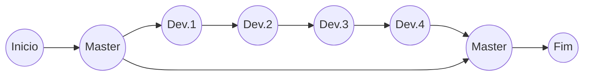

# Git

Do commit ao rebase.

## O que é

> Git é um controle de versionamento `open source` para gerenciamento de um projeto visando a velocidade e eficiência.

## Termos

### O que é Repositório

> Local do Git criado para guardar seu projeto e todas as versões que o mesmo possa ter.

### O que é Commit

> Ponto do processo onde é informado as mudanças que foram feitas através de uma mensagem para ser marcada e documentada no histórico do projeto.

### O que é Branch

> Uma vertente do projeto onde uma funcionalidade foi ou esta sendo criada em paralelo sem estar afetando o resto do projeto.

### O que é Merge

> O processo de juntar duas `branchs` de trabalho em um so, sendo assim, sincronizando o trabalho e funções de ambas as versões.



### O que é Rebase

> Continua com a mesma ideia do `merge` porem com a ideia agora de passar os `commits` que aconteceram com a `branch` para a `branch` de destino.
1. Antes do `rebase`

    ```mermaid
      graph LR;
      Z((Inicio))-->A((Master))
      A-->B((Dev.1))
      B-->C((Dev.2))
      C-->D((Dev.3))
      D-->E((Dev.4))
      A-->F((Master.1))
    ```

2. Depois do `rebase`

    ```mermaid
      graph LR;
      Z((Inicio))-->A((Master))
      A-->B((Master.1))
      B-->C((Dev.1))
      C-->D((Dev.2))
      D-->E((Dev.3))
      E-->F((Dev.4))
    ```

## Comandos

### Init

> Cria e inicializa uma pasta `.git/` dentro do diretório do projeto.

```bash
git init
```

### Remote

> Configura o(s) repositório(s) remoto(s).
1. #### add
    > Adiciona um novo endereço de repositório remoto.

    ```bash
    git remote add <nome> <endereco HTTP ou SHH>
    ```
2. #### remove
    > Remove um endereço de um repositório remoto.

    ```bash
    git remote remove <name>
    ```
3. #### rename
    > Renomeia um repositório já cadastrado.
    ```bash
    git remote rename <nome velho> <novo nome>
    ```

### Branch

> Exibe todas as `branches` - remotas e locais - e destaca a que esta em uso.

```bash
git branch
```

### Checkout

> Troca a `branch` de trabalho atual.

```bash
git checkout <nome da branch>
```

1. Opção -b
    > Ao invés de trocar a `branch`, cria-se uma nova.
    ```bash
    git checkou -b <nome da nova branch>
    ```

### Status

> Mostra como os arquivos da branch local estão em relação a remota.

```bash
git status
```

### Add

> Adiciona arquivos alterados para posteriormente fazer commit dos mesmos.

```bash
git add <filename>
```

### Commit

> Armazena os arquivos mudados em um ponto com uma mensagem definida pelo usuário explicando e listando as mudanças.
1. Opção `-a --all`
    > Adiciona a mensagem para todos os arquivos alterados.
    ```bash
    git commit -a <mensagem>
    ```
2. Opção `-m --message`
    > Adiciona a mensagem para apenas os aquivos previamente adicionados na `Stage changes`
    ```bash
    git commmit -m "<mensagem>"
    git commit --message="<message>"
    ```

### Push

> Publica as mudanças adicionadas e `commitadas` no repositório remoto em um determinada `branch` especificada previamente.

```bash
git push <repositorio> <branch destino>
```

### Diff

> Exibe a diferença entre duas `branchs` ou dois `commits`

```bash
git diff <master..dev>
git diff <d80daf58..7d85fad8>
```

### Rebase

1. Opção `-i --interactive`
    > Inicia o processo de `rebase` de forma interativa, abrindo janelas para seguintes configurações.
    ```bash
    git rebase -i <branch>
    ```

2. Opção --continue
    > Confirma o processo configurado de `rebase` previamente realizado no `git rebase -i`

3. Opção --abort
    > Aborta o processo de `rebase`

### Merge

> Realiza o `merge` de duas `branchs` diferentes.
1. Opção --no-ff
    > Cria apos o `merge` um `commit` para indicar a junção ocorrida.
    ```bash
    git merge --no-ff <branch>
    ```