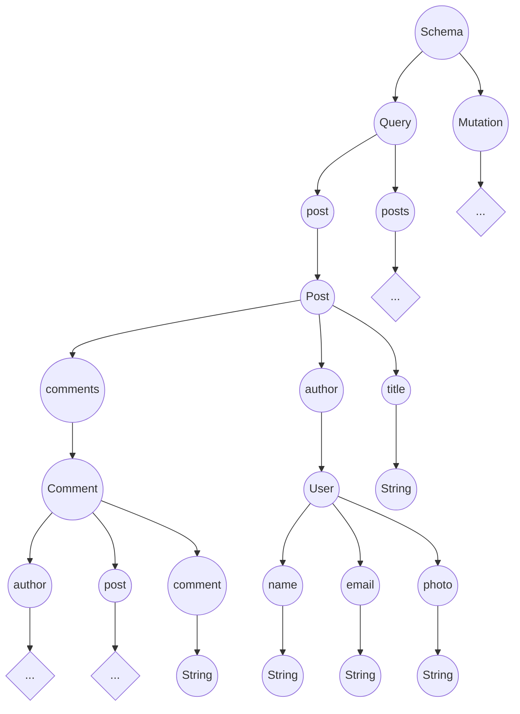

# GraphQL

Um primeiro projeto usando GraphQL, endendo e aplicando.

## O que é

O GraphQL é uma tecnologia de consulta a dados em APIs craida pelo **Facebook** em 2012, e usada por eles desde então. Já em 2015, a empresa disponibilou o recurso como _open source_ para que toda a comunidade pudesse utilizar. Ele não está vinculado com qualquer banco de dados  ou sistema de armazenamento.

## O que ele faz

Uma forma eficiente de busca e consulta de dados em APIs utilizando queries de pesquisa apenas com os campos necessários. Otimizando a quantidade do trafego de dados nas consultas.

## Conceitos básicos

### Type System

Um sistema que  podemos utlizar para definr o tipo de dados que serão trabalhados.

```javascript
type User {
    name: String!
    email: String!
    photo: String
}

type Post {
    title: String!
    content: String!
    photo: String!
    author: User!
    comments: [ Comment! ]!
}

type Comment {
    comment: String,
    user: User!
    post: Post!
}
```

> Usa-se o '!' para definir um campo obrigatório

### Queries

Uma forma de opter dados de uma API, sendo uma analogia ao padrão **REST**, podemos dizer que trabalha de forma parecida com o que seria usado para o método _GET_. Porém usando a ideia de consulta do **GraphQL**.

> Definição de uma query

```javascript
type Query {
    users: [ User! ]!
}
```

> Requisição no Client

```text
{
    query {
        users {
            name
            email
        }
    }
}
```

> JSON retornado

```json
{
    "data": {
        "users": [
            {
                "name": "John",
                "email": "john@doe.com"
            },
            //...
        ]
    }
}
```

### Mutations

Para alterações dos dados da API, voltando a analogia com o padrão **REST**, podemos ver que as _mutations_ englobariam os método _POST_, _PUT_ e _DELETE_.

> Definição da Mutatiion

```javascript
type Mutation {
    createUser(name: String!, email: String!): User!
}
```

> Requisição no Client

```text
{
    mutation {
        createUser(
            name: "John",
            email: "john@doe.com"
        ){
            name
        }
    }
}
```

> JSON retornado

```json
{
    "data": {
        "createUser": {
            "name": "John"
        }
    }
}
```

### Schema

Define o _schema_ da API, funcionando como um _conatainer_ para os tipos criados para a API.

> Definição do Schema

```javascript
type Schema {
    query: Query
    mutation: Mutation
}
```

### Resolver

Para cada compo do _GrqphQL_, deverá exisitir um resolver para cuidar da ação a ser feita.

> Definição da query "user" apra busca pelo Id

```javascript
type Query {
    user(id: ID!):User
}
```

> Resolver assíncrono para querry "user"

```javascript
Query {
    user (parent, args, context, info) {
        return context.db.UserModel.findById(args.id)
    }
}
```

***parent***: O rootField da query original 

***args***: Os argumentos passados na query

***context***: O contexto atual, ou um objeto passado para que o seu estado do momento seja usado como um ainstancia de conexão aberta com o banco.

***info***: os campos do tipo requisitados pela query

#### Resolvers triviais

Defini o resolver que será usado por exemplo após um retorno do banco de dados.

> User

```javascript
type User {
    name: String!
    email: String!
    photo: String
}
```

> Resolvers dos campos do objeto "User"

```javascript
User{
    name(parent, args, context, info) {
        return parent.name;
    },
    email(parent, args, context, info) {
        return parent.email;
    },
    photo(parent, args, contextm info) {
        return parent.photo;
    }
}
```

## Scalar Types

Um campo no _GraphQL_ so terminará de ser processado quando passar por um que apresente valor concreto. Os tipos escalres seriam as **[folhas da árvore](###folhas-da-árvore)**

* Int

Um inteiro de 32-bits (assinado)

* Float

Um ponto flutuante de dupla precisão (assinado)

* String

Uma sequência de caracteres UTF-8

* Boolean

**true** ou **false**

* ID

Representa um identificador  único, geralmente usado para rebuscar um objeto ou como chave de cache.

### Folhas da árvore

A forma de como os campos no GraphQL são resolvidos se assemelha bastante com a estrutura de dados do tipo árvore.

```javascript
type Post {
    title: String!
    content: String!
    photo: String
    author: User!
    comments: [ Comments! ]!
}
```


