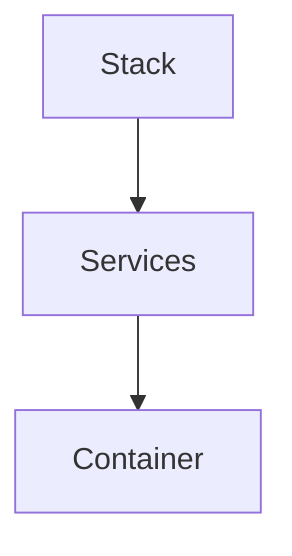
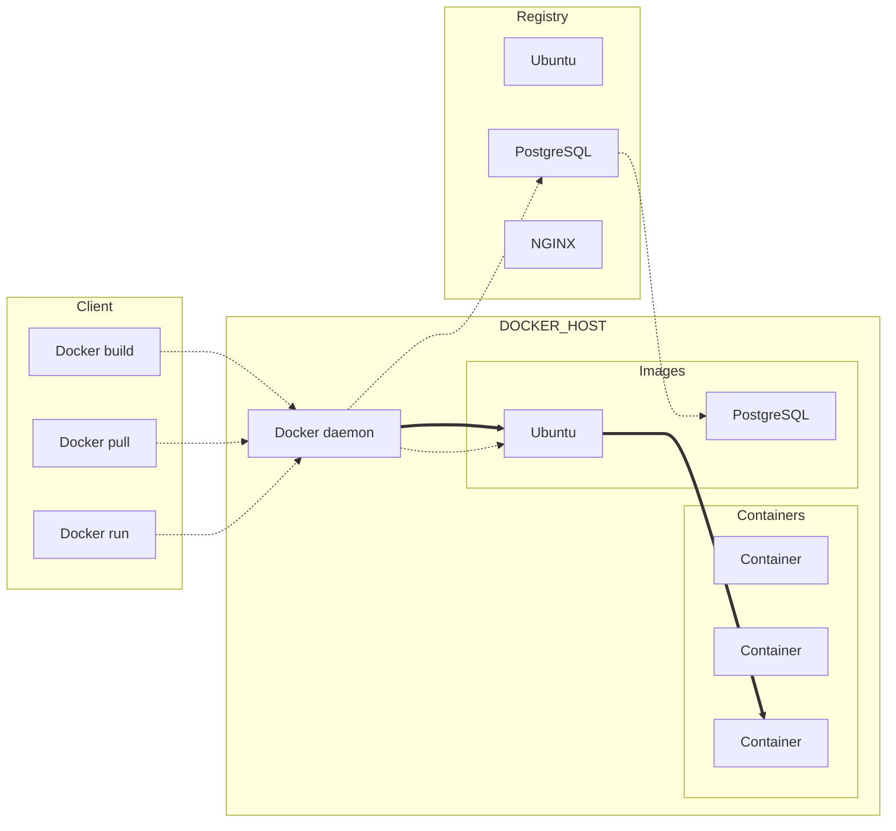

# Docker

Docker é uma plataforma que para desenvolvedores com o objetivo de ***develop***, ***deploy*** e ***run*** aplicações com containers. Embora os containers não sejam uma tecnologia nova, seu uso para o _deploy_ de aplicações é recente. Algumas razões para o seu uso:

1. Flexível
2. _Lightweight_
3. Permutável
4. Portável
5. _Scalable_
6. _Stackable_

## Imagens e containers

Um container é lançado assim que uma imagem é executada. Uma imagem é um pacote executável que contém todas as informações que a aplicação irá precisar, seja arquivos de configuração, variáveis de ambiente, bibliotecas...

## Containers e Máquinas virtuais

Um container usa o mesmo _kernel_ que o _host_, quando executado, se torna um processo leve, não gastando mais que outro executável. Já uma máquina virtual utiliza todo o processamento que um _guest_ requisitaria, alem do fato que uma _vm_ utiliza recursos adicionais que podem não ser usados durante a aplicação.

## Começando com _Docker_

### Um novo ambiente de desenvolvimento

Antigamente para por exemplo para desenvolver uma aplicação em _Python_, um desenvolvedor teria de criar e instalar um ambiente inteiro dentro de sua própria máquina, isso levava também ao fato que aquele ambiente que teria de ser criado necessariamente deveria ser o mesmo do ambiente de produção.

Com **Docker**, precisa-se apenas então de uma imagem _Python_ sem necessidade de instalação, e desenvolver sua aplicação sabendo que código, dependências e ambiente estão andando juntos. Isso tudo é feito dentro de um `Dockerfile`.

### Hierarquia do _Docker_

Para entender melhor a forma que o **Docker** trabalha, com como cada uma de suas partes e funcionalidades, existe uma hierarquia que pode exemplificar muito bem como acontece:



1. _Stack_
    Define as interações de todos os _services_
2. _Services_
    Define como o _container_ se comportará quando em produção
3. _Container_
    Define a estrutura que se tornará o _app_

### Entendendo um `Dockerfile`

Esse arquivo define como funcionará e como será o ambiente dentro de seu container. Nele é possível definir interfaces de rede, virtualização de drivers de disco, o que será isolado do resto do seu sistema, mapeamento de portas ou arquivos que deseja que sejam copiados para dentro de seu container.

### Entendendo os _Services_

Em uma aplicação distribuída, chamamos de _services_ cada pequena _feature_ (função) que ela oferece. Espelhando isso para uma aplicação de compartilhamento de vídeo: temos um _service_ para armazenamento dos dados em um _database_, um _service_ para preparar um vídeo após um _upload_ realizado por um usuário, _services_ presentes no próprio _front-end_ entre muitos outros possíveis.

Um _service_ executa apenas uma imagem, mas também determina quantas daquelas imagens serão executadas, quais portas deverão ser usadas e como. Definir um _service_ muda a forma que as instancias de containers irão ser executadas.

Para isso, cria-se um arquivo chamado `docker-compose.yml`.

### Docker compose

É um arquivo [YAML](https://goo.gl/QHGKzM) que define como os containers **Docker** devem funcionar em ambiente de produção.

```yml
# Definir a versão que será usada
version: '2'
  # Declara os serviços que serão utilizados
  services:
    # Cria um serviço
    pg:
      # Indica a imagem do serviço que será usado
      image: postgres
      # Dependendo da daocumentação oficial,
      # variáveis de ambiente podem ser necessarias
      environment:
        - POSTGRES_USER=admin
        - POSTGRES_PASSWORD=admin
        - POSTGRES_DB=dbName
      # Indica a porta que será usada no container
      # Caso uma porta do container tenha que se comunicar
      # com uma local deve-se indicar <local>:<container>
      # Ex: - 8000:8000
      ports:
        - 5432
      # Indica o que será trabalhado
      volumes:
        - db:/var/lib/pastgresql/data

```

### Entendendo _Swarm Clusters_

_Swarm_ são grupo de computadores que estão executando **Docker** e formam um _cluster_. Depois disso, os comandos continuam a ser executados, porem agora apenas pelo _swarm manager_. Podem ser no caso máquinas virtuais ou físicas, após entrarem no _swarm_, são chamadas de _nodes_.

Os _swarm managers_ podem se utilizar de diversas estratégias para executar seus containers, como por exemplo usar a máquina menos utilizada para guardar os containers, ou assegurar que cada uma tenho exatamente uma instancia de um container especificado. Para definir a estratégia, basta apenas específica-la no `docker-compose`.

_Swarm managers_ são os únicos que podem executar comandos, ou autorizar que outras máquinas possam entrar no _cluster_ como _workers_. Esses por sua vez apenas provem a capacidade, não tendo como autorizar outros a fazer ou não fazer algo.

### _Stacks_

Uma _stack_ se refere a uma grupo de _services_ que compartilham dependências e podem ser organizados e postos juntos. Uma única _stack_ pode definir e coordenar as funcionalidades de uma aplicação inteira, embora as mais complexas possam ter que utilizar mais de uma _stack_.

## _Overview_ do _Docker_

De maneira geral **Docker** é uma plataforma aberta para desenvolvimento, envio e execução de aplicações. Ela permite que desenvolvedores consigam separar a aplicação da infraestrutura, podendo assim gerenciar ambos da mesma maneira.

**Docker** oferece a capacidade de executar uma aplicação de maneira isolada em determinado ambiente chamado de container. O fato de serem seguros e isolados um dos outros e do _host_ permite a execução de vários ao mesmo tempo. Alem de serem bem leves pois usam o _kernel_ do próprio _host_, fazendo melhor uso do processamento quando comparados a máquinas virtuais.

### _Docker engine_

A _engine_ do **Docker** é uma _client-server_ com alguns componentes principais:

* Um server chamado de _daemon_, o comando `dockerd`.

* Uma API REST que específica interfaces para que os programas possam se comunicar com o _daemon_.

* Uma interface de comando em linha (_CLI_), o comando `docker`.

```mermaid
graph TD
N[Network]
C[Container]
I[Image]
D[Data Volumes]
subgraph
DC[Docker CLI]
subgraph
R[REST API]
subgraph
DD[Daemon Docker]
end
end
end
N-->|Gere|DC
C-->|Gere|DC
I-->|Gere|DC
D-->|Gere|DC
DC-->R
R-.->DC
R-->DD
DD-.->R
```

A interface de comando por linha utiliza a API REST para se comunicar com o _daemon_ por comandos ou scripts.
Por sua vez o _daemon_ gerencia a construção e administração dos objetos criados bem como seus volumes, _networks_ e imagens.

## Cenários para se usar _Docker_

**Docker** agiliza o ciclo de desenvolvimento de uma aplicação, já que oferece uma padronização dos ambientes com containers para sua aplicação e serviços.

### _Deploy_ e dimensionamento responsivo

Plataformas baseadas em containers **Docker** são bem portáveis, podendo ser executadas em laptops locais de desenvolvedores, maquinas físicas ou virtuais, _data centers_, provedores de nuvens ou uma mistura de ambientes diferentes.

Dado sua portabilidade e baixo uso de processamento, também oferece uma maneira fácil de dinamicamente alocar e gerenciar _workloads_, podendo realizar mudanças quase em tempo real com facilidade dependendo da necessidade.

### Executando mais _workloads_ no mesmo Hardware

Outro diferencial levantado por sua leveza é o fato de oferece uma alternativa ás máquinas virtuais, sendo assim, podendo exigir mais da máquina que está sendo usada. **Docker** é ideal para ambientes densos e complexos para pequenos ou médios _deploys_ que necessitam de menos recursos.

## Arquitetura _Docker_

**Docker** utiliza uma arquitetura de _client-server_. O _client_ do **Docker** se comunica com o _daemon_ que fica responsável por construir, executar e distribuir seus containers. Tanto _client_ quanto _daemon_ podem estar no mesmo sistema, ou um acessando o outro de forma remota, neste último, o _client_ irá se comunicar através da API REST e de _sockets_ UNIX para com o _daemon_.



### _Docker daemon_

Responde as requisições da API REST, controla, gere e administra objetos **Docker** como imagens, containers, _networks_ e volumes. _Daemons_ podem também se comunicar entre si para administrar serviços **Docker**.

### _Docker client_

É a maneira de como a maioria dos usuários se comunica com o _daemon_, através dos comandos que executaram e realizarão as requisições com API REST para o _daemon_.

### _Docker registry_

Armazena as imagens disponíveis para criação de containers, _Docker Hub_ e _Docker Cloud_ são repositórios públicos que todos podem usar. Por padrão, **Docker** busca imagens no _Docker Hub_. Mas também pode-se adicionar repositórios para uso.

Quando se executa comandos como `docker pull` ou `docker run`, **Docker** automaticamente busca as imagens requisitadas nos repositórios disponíveis, adicionados ou informados.

### _Docker objects_

Usando **Docker**, está automaticamente criando Imagens, Volumes, Containers, _Networks_, Plugins e outros objetos.

* Images
    São templates de leitura com instruções de criação de containers para uso. Frequentemente usa-se uma imagem para poder criar outra com serviços ou _features_ adicionais. Como por exemplo, criar uma imagem de `Ubuntu`, utilizando uma imagem oficial e configura-la para instalar um Apache Web Server, bem como configurações adicionais para a aplicação caso necessário.

* Containers
    É uma instancia criada a partir de uma imagem especificada. Essa instancia pode ser criada, iniciada, parada, movida ou removida usando a API **Docker** ou a `CLI`. Um container pode estar conectado a uma ou mais _networks_, receber armazenamento, ou servir de modelo para a criação de uma imagem de seu estado atual.

* Services
    Permitem que containers trabalhem com múltiplos _daemons_, que quando juntos trabalham em _swarm_ gerenciando vários _workers_. Cada membro do _swarm_ é um _daemon_ que se comunica através da API **Docker**.

## Tecnologia _underlying_

Escrito em [GO](https://goo.gl/Wbspxt), **Docker** utiliza o _kernel_ do Linux para poder demonstrar e apresentar sua funcionalidade e praticidade.

### _Namespaces_

Utilizando uma tecnologia denominada `namespace` que promove uma _workspace_ única e isolada para containers. Assim no momento de criação de um container, um novo `namespace` é criado.

Essa tecnologia possibilita que o container seja executado em uma camada isolada e dedicada a apenas ele, limitando seu acesso a somente seu próprio `namespace`.

Alguns `namespaces` utilizados pela _Docker engine_ que também são utilizadas no Linux:

* `pid` - Isolamento do processo
* `net` - Gerenciamento de interfaces de rede
* `ipc` - Gerenciamento de acesso para recursos IPC
* `mnt` - Gerenciamento de _filesystem mount points_
* `uts` - Isolamento de Kernel e identificadores de versão

### Grupos de controle

_Docker engine_ sendo usada em um ambiente Linux dispõe também de uma tecnologia chamada _control groups_ (`cgroups`). Um _control group_ define e restringe para uma aplicação um conjunto fechado de recursos de hardware para serem usadas. Pode-se por exemplo definir uma quantidade limitada de memória que poderá ser utilizada por um específico container.

### _Union file system_

Criam layers para a operação do containers, fazendo-os assim leves e rápidos. A _Docker engine_ utiliza `UnionFS` para prover a construção de blocos para os containers.

### Formato do container

É a maneira que a _Docker engine_ utiliza `namespaces`, `control groups` e `UnionFS` para a criação de um _wrapper_ chamado `container format`.

## Imagens oficiais

Algumas imagens oficiais são oferecidas no [Docker Hub](https://goo.gl/zTQasP) para serem usadas. Assim, tirando a necessidade de construir o _Dockerfile_.