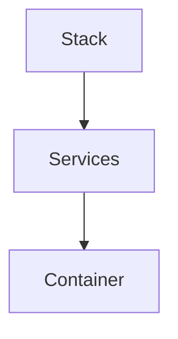
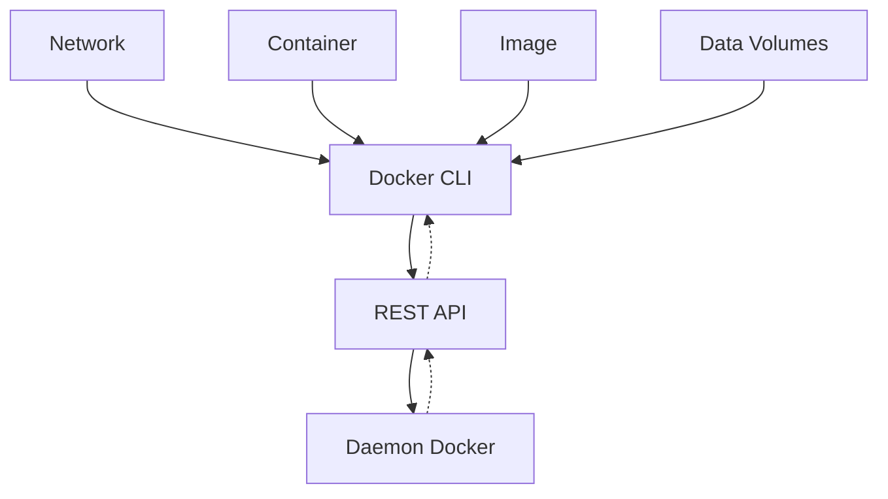

# Docker

Docker é uma plataforma que para desenvolvedores com o objetivo de ***develop***, ***deploy*** e ***run*** aplicações com containers. Embora os containers não sejam uma tecnologia nova, seu uso para o _deploy_ de aplicações é recente. Algumas razões para o seu uso:

1. Flexível
2. _Lightweight_
3. Permutável
4. Portável
5. _Scalable_
6. _Stackable_

## Imagens e containers

Um container é lançado assim que uma imagem é executada. Uma imagem é um pacote executável que contém todas as informações que a aplicação irá precisar, seja arquivos de configuração, variáveis de ambiente, bibliotecas...

## Containers e Máquinas virtuais

Um container usa o mesmo _kernel_ que o _host_, quando executado, se torna um processo leve, não gastando mais que outro executável. Já uma máquina virtual utiliza todo o processamento que um _guest_ requisitaria, alem do fato que uma _vm_ utiliza recursos adicionais que podem não ser usados durante a aplicação.

## Começando com _Docker_

### Um novo ambiente de desenvolvimento

Antigamente para por exemplo para desenvolver uma aplicação em _Python_, um desenvolvedor teria de criar e instalar um ambiente inteiro dentro de sua própria máquina, isso levava também ao fato que aquele ambiente que teria de ser criado necessariamente deveria ser o mesmo do ambiente de produção.

Com _Docker_, precisa-se apenas então de uma imagem _Python_ sem necessidade de instalação, e desenvolver sua aplicação sabendo que código, dependências e ambiente estão andando juntos. Isso tudo é feito dentro de um `Dockerfile`.

### Hierarquia do _Docker_

Para entender melhor a forma que o _Docker_ trabalha, com como cada uma de suas partes e funcionalidades, existe uma hierarquia que pode exemplificar muito bem como acontece:



1. _Stack_
    Define as interações de todos os _services_
2. _Services_
    Define como o _container_ se comportará quando em produção
3. _Container_
    Define a estrutura que se tornará o _app_

### Entendendo um `Dockerfile`

Esse arquivo define como funcionará e como será o ambiente dentro de seu container. Nele é possível definir interfaces de rede, virtualização de drivers de disco, o que será isolado do resto do seu sistema, mapeamento de portas ou arquivos que deseja que sejam copiados para dentro de seu container.

### Entendendo os _Services_

Em uma aplicação distribuída, chamamos de _services_ cada pequena _feature_ (função) que ela oferece. Espelhando isso para uma aplicação de compartilhamento de vídeo: temos um _service_ para armazenamento dos dados em um _database_, um _service_ para preparar um vídeo após um _upload_ realizado por um usuário, _services_ presentes no próprio _front-end_ entre muitos outros possíveis.

Um _service_ executa apenas uma imagem, mas também determina quantas daquelas imagens serão executadas, quais portas deverão ser usadas e como. Definir um _service_ muda a forma que as instancias de containers irão ser executadas.

Para isso, cria-se um arquivo chamado `docker-compose.yml`.

### Docker compose

É um arquivo [YAML](https://goo.gl/QHGKzM) que define como os containers _Docker_ devem funcionar em ambiente de produção.

```yml
# Definir a versão que será usada
version: '2'
  # Declara os serviços que serão utilizados
  services:
    # Cria um serviço
    pg:
      # Indica a imagem do serviço que será usado
      image: postgres
      # Dependendo da daocumentação oficial,
      # variáveis de ambiente podem ser necessarias
      environment:
        - POSTGRES_USER=admin
        - POSTGRES_PASSWORD=admin
        - POSTGRES_DB=dbName
      # Indica a porta que será usada no container
      # Caso uma porta do container tenha que se comunicar
      # com uma local deve-se indicar <local>:<container>
      # Ex: - 8000:8000
      ports:
        - 5432
      # Indica o que será trabalhado
      volumes:
        - db:/var/lib/pastgresql/data

```

### Entendendo _Swarm Clusters_

_Swarm_ são grupo de computadores que estão executando _Docker_ e formam um _cluster_. Depois disso, os comandos continuam a ser executados, porem agora apenas pelo _swarm manager_. Podem ser no caso máquinas virtuais ou físicas, após entrarem no _swarm_, são chamadas de _nodes_.

Os _swarm managers_ podem se utilizar de diversas estratégias para executar seus containers, como por exemplo usar a máquina menos utilizada para guardar os containers, ou assegurar que cada uma tenho exatamente uma instancia de um container especificado. Para definir a estratégia, basta apenas específica-la no `docker-compose`.

_Swarm managers_ são os únicos que podem executar comandos, ou autorizar que outras máquinas possam entrar no _cluster_ como _workers_. Esses por sua vez apenas provem a capacidade, não tendo como autorizar outros a fazer ou não fazer algo.

### _Stacks_

Uma _stack_ se refere a uma grupo de _services_ que compartilham dependências e podem ser organizados e postos juntos. Uma única _stack_ pode definir e coordenar as funcionalidades de uma aplicação inteira, embora as mais complexas possam ter que utilizar mais de uma _stack_.

## _Overview_ do _Docker_

De maneira geral _Docker_ é uma plataforma aberta para desenvolvimento, envio e execução de aplicações. Ela permite que desenvolvedores consigam separar a aplicação da infraestrutura, podendo assim gerenciar ambos da mesma maneira.

_Docker_ oferece a capacidade de executar uma aplicação de maneira isolada em determinado ambiente chamado de container. O fato de serem seguros e isolados um dos outros e do _host_ permite a execução de vários ao mesmo tempo. Alem de serem bem leves pois usam o _kernel_ do próprio _host_, fazendo melhor uso do processamento quando comparados a máquinas virtuais.

### _Docker engine_

A _engine_ do _Docker_ é uma _client-server_ com alguns componentes principais:

* Um server chamado de _daemon_, o comando `dockerd`.

* Uma API REST que específica interfaces para que os programas possam se comunicar com o _daemon_.

* Uma interface de comando em linha (_CLI_), o comando `docker`.



## Imagens oficiais

Algumas imagens oficiais são oferecidas no [Docker Hub](https://goo.gl/zTQasP) para serem usadas. Assim, tirando a necessidade de construir o _Dockerfile_.