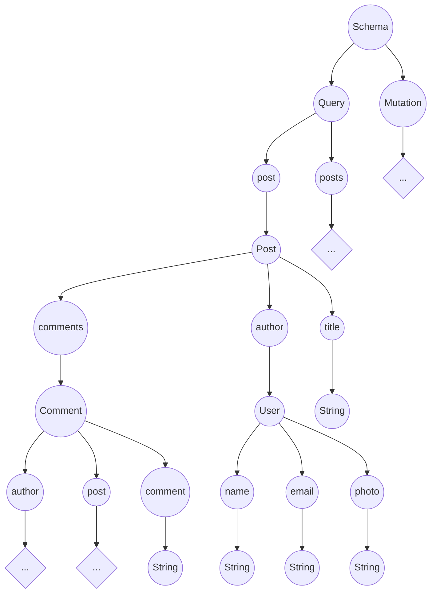

# GraphQL

Um primeiro projeto usando ***GraphQL***, endendo e aplicando.

## O que é

O ***GraphQL*** é uma tecnologia de consulta a dados em APIs criada pelo **Facebook** em 2012, e usada por eles desde então. Já em 2015, a empresa disponibilizou o recurso como _open source_ para que toda a comunidade pudesse utilizar. Ele não está vinculado com qualquer banco de dados  ou sistema de armazenamento.

## O que ele faz

Uma forma eficiente de busca e consulta de dados em APIs utilizando queries de pesquisa apenas com os campos necessários. Otimizando a quantidade do trafego de dados nas consultas.

### Conceitos básicos

#### Type System

Um sistema que  podemos utilizar para definir o tipo de dados que serão trabalhados.

```javascript
type User {
    name: String!
    email: String!
    photo: String
}

type Post {
    title: String!
    content: String!
    photo: String!
    author: User!
    comments: [ Comment! ]!
}

type Comment {
    comment: String,
    user: User!
    post: Post!
}
```

> Usa-se o '!' para definir um campo obrigatório

#### Queries

Uma forma de obter dados de uma API, sendo uma analogia ao padrão _REST_, podemos dizer que trabalha de forma parecida com o que seria usado para o método _GET_. Porém usando a ideia de consulta do ***GraphQL***.

> Definição de uma query

```javascript
type Query {
    users: [ User! ]!
}
```

> Requisição no Client

```text
{
    query {
        users {
            name
            email
        }
    }
}
```

> JSON retornado

```json
{
    "data": {
        "users": [
            {
                "name": "John",
                "email": "john@doe.com"
            },
            //...
        ]
    }
}
```

#### Mutations

Para alterações dos dados da API, voltando a analogia com o padrão _REST_, podemos ver que as _mutations_ englobariam os método _POST_, _PUT_ e _DELETE_.

> Definição da Mutatiion

```javascript
type Mutation {
    createUser(name: String!, email: String!): User!
}
```

> Requisição no Client

```text
{
    mutation {
        createUser(
            name: "John",
            email: "john@doe.com"
        ){
            name
        }
    }
}
```

> JSON retornado

```json
{
    "data": {
        "createUser": {
            "name": "John"
        }
    }
}
```

#### Schema

Define o _schema_ da API, funcionando como um _container_ para os tipos criados para a API.

> Definição do Schema

```javascript
type Schema {
    query: Query
    mutation: Mutation
}
```

#### Resolver

Para cada compo do ***GraphQL***, deverá existir um resolver para cuidar da ação a ser feita.

> Definição da query "user" apra busca pelo Id

```javascript
type Query {
    user(id: ID!):User
}
```

> Resolver assíncrono para querry "user"

```javascript
Query {
    user (parent, args, context, info) {
        return context.db.UserModel.findById(args.id)
    }
}
```

**parent**: O rootField da query original

**args**: Os argumentos passados na query

**context**: O contexto atual, ou um objeto passado para que o seu estado do momento seja usado como uma instancia de conexão aberta com o banco.

**info**: os campos do tipo requisitados pela query

#### Resolvers triviais

Defini o resolver que será usado por exemplo após um retorno do banco de dados.

> User

```javascript
type User {
    name: String!
    email: String!
    photo: String
}
```

> Resolvers dos campos do objeto "User"

```javascript
User{
    name(parent, args, context, info) {
        return parent.name;
    },
    email(parent, args, context, info) {
        return parent.email;
    },
    photo(parent, args, contextm info) {
        return parent.photo;
    }
}
```

### Scalar Types

Um campo no ***GraphQL*** so terminará de ser processado quando passar por um que apresente valor concreto. Os tipos escalares seriam as **[folhas da árvore](###folhas-da-árvore)**

* Int

Um inteiro de 32-bits (assinado)

* Float

Um ponto flutuante de dupla precisão (assinado)

* String

Uma sequência de caracteres UTF-8

* Boolean

**true** ou **false**

* ID

Representa um identificador  único, geralmente usado para rebuscar um objeto ou como chave de cache.

#### Folhas da árvore

A forma de como os campos no ***GraphQL*** são resolvidos se assemelha bastante com a estrutura de dados do tipo árvore.

```javascript
type Post {
    title: String!
    content: String!
    photo: String
    author: User!
    comments: [ Comments! ]!
}
```



### GraphQL > REST

As APIs montadas com o padrão _REST_ retornam um estrutura fixa de dados que começou a se mostrar inflexível quanto as requisições dos _Clients_. Para cada conjunto de dados ou dado requerido, devia-se usar _endpoints_ que retornassem somente o desejado, ou que retornassem mais que o necessário e tratar o que seria usado depois. Foi então que o ***GraphQL*** foi desenvolvido para suprir essa necessidade, trazendo mais eficiência e flexibilidade para as requisições que antes eram tratadas com _REST_.

1. **no underfetching**

    No ***GraphQL*** não há necessidade de criar vários _endpoints_. Por exemplo, não temos que ter um _endpoint_ para recuperar um usuário, outro para buscar seus seguidores ou para suas fotos como teria que haver no padrão _REST_.

    > Vários _endpoints_ desnecessários

    ```text
    /users/<id>
    /users/<id>/posts
    /users/<id>/followers
    ```

    > Tipo _User_ para consulta

    ```javascript
    type User{
        name: String!
        email: String!
        posts: [ Post ]
        followers: [ User ]
    }
    ```

2. **no overfetching**

    "Poderíamos então para manter o padrão _REST_ passar de uma vez todas as informações que estivessem vinculadas com o Usuário por exemplo". Mas isso acabaria acarretando em outro problema que é o _overfetching_, estaríamos criando um intenso tráfego de dados que dificilmente iriam ser 100% usados, acabaríamos requisitando um Usuário inteiro, suas fotos, posts, seguidores... apenas para usar seu nome talvez. Isso é facilmente resolvido com o ***GraphQL***, visto que em suas _queries_ podemos dizer exatamente o que usaremos de informação para que não seja transportado informações desnecessárias.

    * Usando REST

     > Requisição: /posts/73

     Resposta:

    ```json
    {
        "post": {
            "title": "Aprendendo GraphQL",
            "content": "Aula 1",
            "comments": [...],
            "author": [...]
        }
    }
    ```

    * Usando GraphQL

    > Query

    ```text
    {
        query {
            post(id: 73) {
                title
                author{
                    name
                }
            }
        }
    }
    ```

    Resposta:

    ```json
    {
        "data": {
            "post": {
                "title": "Aprendendo GraphQL",
                "author": {
                    "name": "John"
                }
            }
        }
    }
    ```

3. **Rápida prototipagem**

    Uma prática comum para evitar o _underfetching_ bem como _overfetching_ no padrão _REST_ era criar os _endpoints_ de acordo com as views. Embora não ocorra os dois citados acima, isso apenas criava um problema para alguma manutenção futura no _front-end_, ou seja, caso essa mudança na view alterasse o uso de dados que era usado, teria que mudar também a implementação do _endpoint_ usado. Já com o ***GraphQL***, nenhum engenheiro tem que fazer qualquer alteração no _back-end_.

4. **Schema e Type System**

    O fato de poder ter uma modelagem de dados própria em seus _schemas_faz com que o desenvolvimento seja mais fluído e organizado, visto que a tipagem dos dados pode servir ate como meio de documentação. Assim, em uma primeira reunião, o _back-end_ e _front-end_ poderiam definir a estrutura de dados e seus tipos, após documentar isso usando o **[GraphQL](##GraphQL)**, ambos poderiam trabalhar mais separados agora.