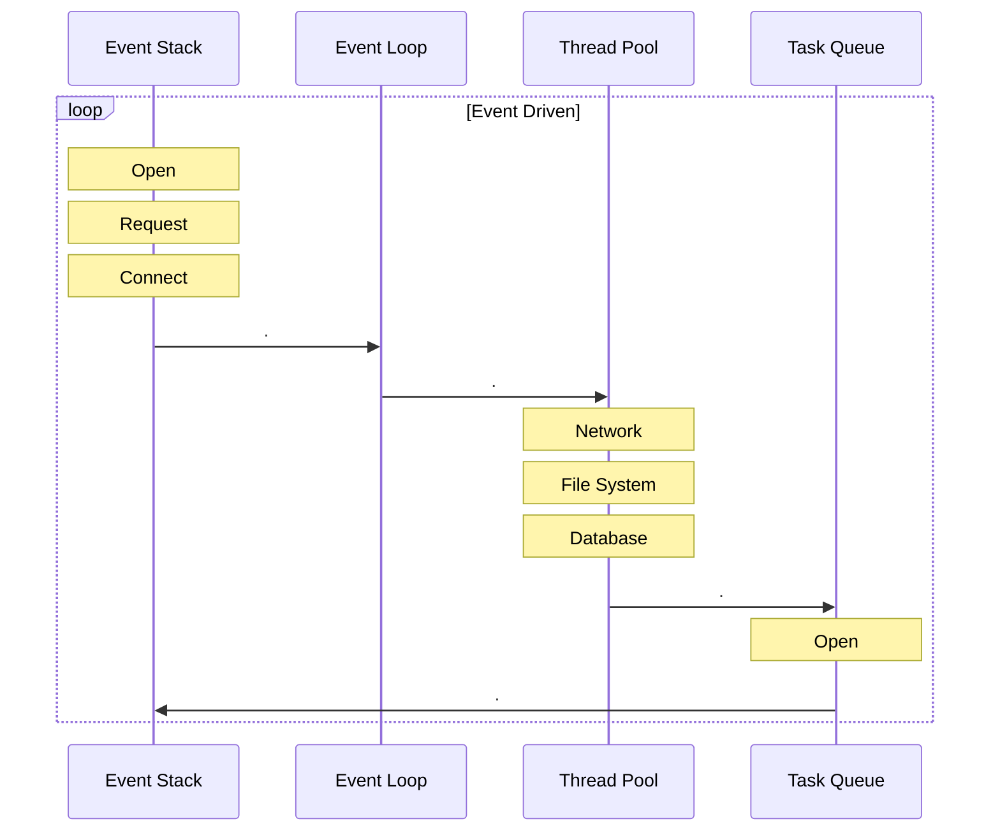

# NodeJS

## O que é

É uma plataforma criada em cima do motor _JavaScript V8_ do Google Chrome que nos possibilita executar códigos _JavaScript_ diretamente no servidor. Ideal para o desenvolvimento de aplicações em que haja uma constante comunicação entre o _Client_ e o _Server_, alem de troca de dados entre dispositivos distribuídos. Exemplos de sua aplicabilidade seriam serviços de _Chats_, _Feed de notícias_ e _Web push notifications_.

## Como funciona

Ao contrário de outras linguagens como Java ou Ruby, NodeJS é _single thread_, ou seja, trabalha e executa uma _Thread_ por processo iniciado. Mas existem bibliotecas e outras maneiras que permitem que essa funcionalidade seja incorporada ao NodeJS.

Outra forma de processamento paralelo é o conceito de _Assincronismo_. O _NodeJS_ trabalha com eventos de _I/O não bloqueantes_, ou seja, caso a aplicação em questão necessite fazer um processo paralelo como ler um grande arquivo, essa tarefa será colocada em _background_, e após a fila de tarefas for terminada, o _callback_ da leitura do arquivo será chamado.

Um exemplo de uma de suas principais características é poder trabalhar com múltiplas conexões e trabalhar com cada uma, a partir da requisição, o _callback_ é acionado e a _response_ é enviada. Caso não haja processos a serem trabalhados, o NodeJS irá dormir.

```javascript
const http = require('http')

const hostname = 'localhost'
const port = 8000

const server = http.createServer((req, res) => {
    res.statusCode(200)
    res.json({ data: 'Hello, world!' })
})

server.listen(port, hostname, () => {
    console.log(`Server running at http://${hostname}:${port}/`)
})
```

## Por que NodeJS

Isso é um grande contraste com a maneira atual, onde operações com o sistema operacional são empregadas. Sendo _threads_ baseadas em rede relativamente difíceis e ineficientes para serem usadas. Porem usuários do NodeJS estão livres de processos _dead-locking_, já que quase nenhuma função no Node realiza _I/O_, então o processo nunca é interrompido.

### Entendendo _blocking_ e _non-blocking_

 _Blocking_ se refere quado a execução tem que ser interrompida pois JavaScript adicional teve que esperar para que operações _non_-JavaScript fossem executadas. Isso ocorre pois não se pode executar JavaScript enquanto um  processo _blocking_ está ocorrendo.

Em NodeJS, o JavaScript que apresenta um uso insatisfatório da _CPU_ ao invés de aguardar um processo _non_-JavaScript como _I/O_ geralmente não é referenciado como _blocking_. Métodos síncronos são os mais comuns usando operações  de _blocking_. Módulos nativos do NodeJS também tem métodos _blocking_.

Todos os métodos que realizam _I/O_ no NodeJS oferecem alternativas assíncronas sendo _non-blocking_, aceitando funções de _callback_. Para esses métodos, funções síncronas, sendo _blocking_, também são oferecidas, apresentado como sufixo _Sync_.

* Uma operação síncrona (_blocking_)

```javascript
const fs = require('fs')

const data = fs.readFileSync('./file.md')
console.log(data)
moreWork()
```

> A função _moreWork_ será executada APÓS o console.log.

* Uma operação assíncrona (_non-blocking_)

```javascript
const fs = require('fs')

fs.readFile('./file.md', (err, data) => {
    if (err) throw err
    console.log(data)
})
moreWork()
```

> A função _moreWork_ será executada ANTES do console.log

Para entender melhor, no primeiro exemplo, `moreWork()` será executada após `console.log()`, tornado a operação de leitura _blocking_ e impedindo que se continue o processamento ate que a mesma seja finalizada. Já no segundo exemplo, um _callback_ é informado para a função, que logo depois de ser concluída irá chama-lo para executa-lo, tornado-a _non-blocking_ e permitindo que a execução prossiga.

## _Event Loop_

O NodeJS é totalmente guiado por eventos, termo que ficou conhecido como _Event Driven_, por sua vez, esse conceito se refere a um fluxo determinado de acontecimentos, eventos ou alterações de estado que possam ocorrer, em que caso essas mudanças ocorram, _callback_ definidas para cada uma sejam ativados e chamados. Isso já em bem conhecido e popular para usuários de JavaScript no _front-end_ como o _onClick, _onHide_, _onHide_ que são bem comuns.



## Conceitos e _features_ importantes

### Promises

Sendo em sua ideia principal o retorno de uma operação assíncrona, ou seja, para poder trabalhar com o resultado que será recebido no futuro, utilizamos o conceito de _promise_,  que se apresenta em três possíveis estados:

1._Pending_
    O estado inicial de uma _promise_.

2._Fulfilled_
    O estado da _promise_ quando retornada com sucesso.

3._Rejected_
    O estado da _promise_ quando retornada com erro.

```javascript
function readFile(filename, enc){
    return new Promise((fulfill, reject) => {
        fs.readFile(filename, (err, data) => {
            if (err) reject(err)
            fulfill(data)
        })
    })
}
```

> Um exemplo básico usando a leitura de um arquivo de maneira assíncrona.
> Criando uma _Promise_ e passando como parâmetro uma função que aceita um _resolver_ (_fulfill_) e um _reject_ (_reject_). Após o termino da leitura, caso retorne um erro, usaremos o _reject_ para rejeitar a _Promise_ retornando o erro, caso contrário, iremos dar a _Promise_ como realizada e retornaremos os dados.

Para operações que retornem _Promises_ podemos encadear a função com o método `then()`, que pode receber dois argumentos, um para quando a _promise_ for realizada e outro para quando for rejeitada.

```javascript
readFile('./name.txt', 'utf-8').then((result) => {
    console.log('File read successfully.')
}, (err) => {
    console.log('A unespected error occurred.')
})
```

Pode-se também encadear múltiplos métodos `then`.

```javascript
promise.then((value) => {
    console.log(value) // 1
    return value + 4
}).then((value) => {
    console.log(value) // 5
})
```

### Event Emitters

Como o próprio nome já diz (emissor de eventos), apenas fica encarregado de ativar um evento que qualquer um possa ouvir. Diferentes bibliotecas, implementações ou _frameworks_ desencadeiam em diferentes propósitos, porem a ideia continua a mesma, apenas definir uma ação para determinado evento.

No NodeJS, essas ações são correspondestes  aos _callbacks_. Defini-se também se essa ação será executada todas as vezes que o evento ocorrer, ou caso seja necessário apenas na primeira vez.

```javascript
const office = require('office')

office.door.on('knock', () => {
    console.log('Someone is on the door')
})
```

Neste exemplo, utilizamos uma biblioteca fictícia `office`, em que adicionamos um _listener_ com o método `on`, para que cada vez que alguém batesse na porta, um aviso seria retornado.

## NPM (_Node package manager_)

NPM é o repositório oficial de dependências para o NodeJS, em que pode-se pesquisar, baixar e publicar novas dependências para seu ambiente de desenvolvimento.

> O NPM já é instalado automaticamente durante o mesmo procedimento do NodeJS

Há uma variedade e uma gama enorme de repositórios disponíveis para uso no NPM, todas as dependências utilizadas ficam registradas no `packagem.json` presente no projeto, como sendo dependência de desenvolvimento ou de produção.

```json
{
    "name": "project",
    "version": "1.0.0",
    "description": "Sample project",
    "main": "src/index.js",
    "scripts": {
        "start": "nodemon src/index.js"
    },
    "repository": {
        "type": "https://github.com/User/project.git",
    },
    "keywords": [
        "Express",
        "NodeJs",
        "MongoDB"
    ],
    "author": "User <user@mail.com>",
    "license": "MIT",
    "devDependencies": {
        "nodemon": "^1.0.0",
    },
    "dependencies": {
        "express": "1.0.0",
        "mongoose": "^1.0.0"
    }
}
```

Um exemplo de um arquivo `package.json` com alguns campos básicos.

* _name_:
    > Nome do projeto

* _version_
    > Versão do projeto

* _description_
    > Descrição do projeto

* _main_
    > Script principal

* _scripts_ ***[Opcional]***
    > Scripts para serem executados pelo _npm_

* _respository_ ***[Opcional]***
    > Informações sobre o repositório

* _keywords_ ***[Opcional]***
    > Tags para pesquisa

* _author_
    > Nome e E-mail do author

* _license_ ***[Opcional]***
    > Tipo da licença do projeto

* _devDependencies_ ***[Opcional]***
    > Dependências de desenvolvimento do projeto

* _dependencies_ ***[Opcional]***
    > Dependências de produção do projeto